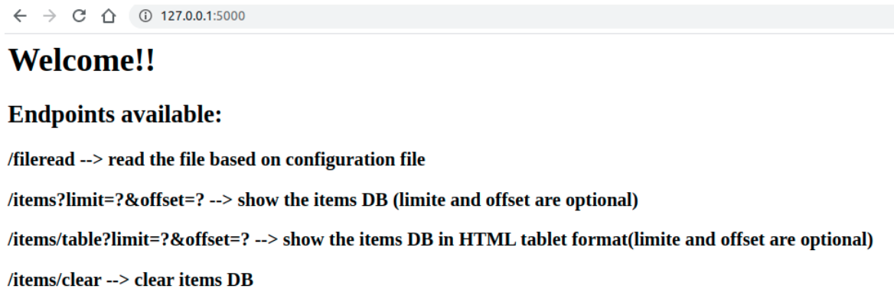
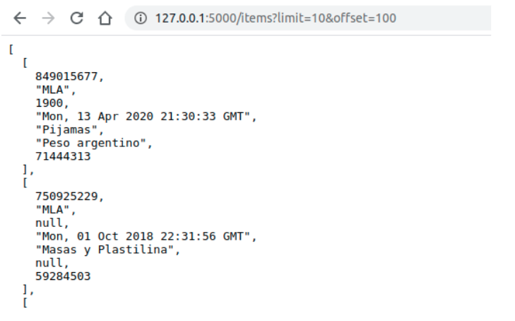
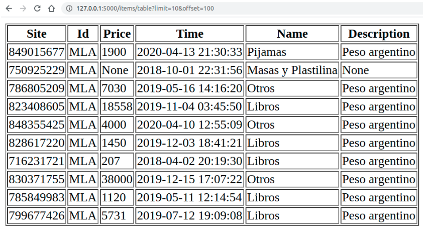

# API
Este documento describe como configurar y utilizar la API

## Archivo de configuración
El archivo de configuración __"config.ini"__ tiene los siguientes parámetros configurables:\

```
[meli]
api_item_call=CategoryApi,CurrencyApi
[filestream]
name=technical_challenge_data.csv
type=CsvStream
delimiter=,
encoding=utf-8
chunk_size=500
[db]
host=localhost
port=5432
database=meli
user=postgres
password=1234
schema=schema.sql
[server]
host=0.0.0.0
port=5000
```
#### meli
En este momento hay un único parámetro de configuración para la API de meli, el cual especifica al usuario que otras APIs queremos que sean consultadas en cadena con la API de items. La aplica implementada soporta el consumo en cadena de las siguientes APIs:\
- ItemsApi
    - CategoryAPi
    - CurrencyApi
    - UserApi --> quedó pendiente de implementación por falta de TOKEN_ACESS

El sistema soporta encadenar futuras consultas de cualquier API cualquiera que se cree como clase que herede de __ApiMeli__ y se especifique en esta sección del archivo de configuración.

#### filestream
En esta sección se especifica parámetros de configuración del archivo de stream a consumir:
- El nombre del archivo (la API espera que el archivo se encuentra en la raiz de la carpeta /api).
- El tipo de archivo que se desea consumir (csv: CsvStream, txt: TxtStream, jsonl: JsonlStream).
- El delimitardor con el cual están separados los datos [,] [|] [ ].
- El encoding del archivo.

#### db
En esta sección se especifica parámetros de configuración de la base de datos:
- host y port de la base de datos (especificador al lanzar el servicio de postgreSQL).
- el nombre de la base de datos.
- user y password de la base de datos (especificador al lanzar el servicio de postgreSQL).
- El archivo sql para crear el esquema en la primera ejecución.

Si el sistema al intentar conectar con la base de datos verifica que esta no existe (primera ejecución), creará la base de datos y las tablas pertinentes basado en el archivo de schema.sql.

#### server
Parámetros de configuración básicos del server Flask (host y port).

## URL de bienvenida

#### URL
`/`

#### Method
`GET`

#### Response
Responde con una pantalla html con las diferentes alternativas de uso de la API.


## Consumir el archivo de items

#### URL
`/fileread`

#### Method
`GET`

#### Response
Cuando el sistema termine de consumir el archivo responderá con el tiempo que demoró en consumir y persistir los datos.

## Solicitar la información de items en la base de datos

#### URL
`/items?limit<limit>&offset<offset>`
`/items/table?limit<limit>&offset<offset>`

#### Method
`GET`

#### Response
Según al endpoint que se consulte el sistema devolverá toda la información que posee de los items persistidos (acotado por __limit__ y __offset__) en un formato u otro de presentación.

###### /items

###### /items/table
