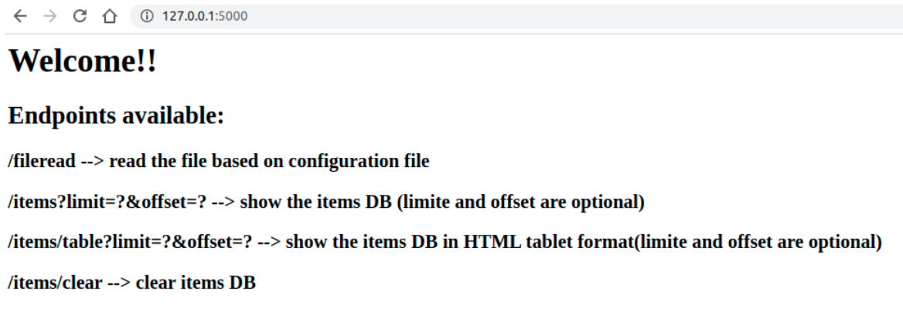
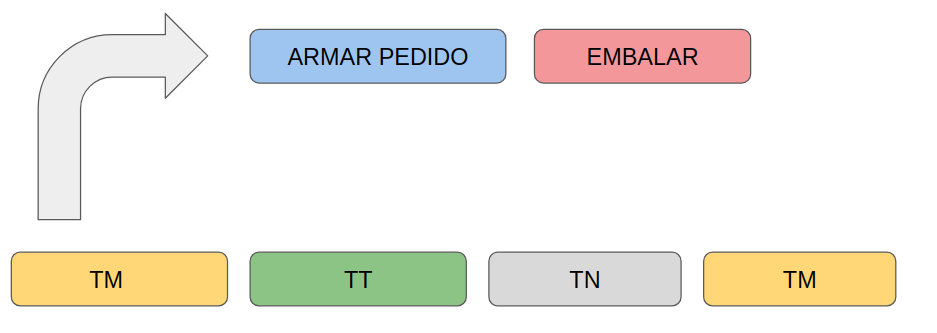

# Breve marco teórico sobre procesos, threads y corrutinas

## Procesos

Los procesos son hilos del sistema operativo, pueden correr en paralelo en distintos CPUs y compartir información mediante socket, archivos, bases de datos, etc. El scheduler del sistema operativo es quien decide cuándo comienza y termina un proceso según la planificación del mismo.

## Threads

Los threads son hilos del proceso en sí, comparten los recursos que este proceso posee y se reparten entre todos los threads creados. Los threads corren tal como corren los procesos que corren en un solo núcleo, deben compartir el tiempo de CPU y es el sistema operativo quien planifica cuando se ejecutará uno u otro thread (excepto en python que le intérprete se encuentra en el medio interfiriendo).

En los casos mencionados donde el OS es quien planifica la ejecución de los mismos, podría tener 2 procesos que corren en un while(1) pero que aún así ambos tendrán su tiempo de ejecución repartido según la estrategia de planificación. En general los procesos o los threads al tener que acceder a recursos o compartir información involucrando un mutex producen que este se detenga y no sea desplanificado hasta que el recurso que necesita se encuentre disponible. Típico de estos casos son los pattern de productor consumidor.

## Corrutinas

Las corrutinas en cambio corren en el mismo CPU y en un mismo thread (por defecto), dando una suerte de “paralelización” controlada cooperativa. El programador es quien le da el hint al sistema de que la corrutina tiene que esperar por un recurso y se planifica la siguiente corrutina en el mientras tanto, por esto son estructuras mucho más simples las cuales consumen mucho menos memoria implementarlas y recursos.. Esto permite que en aplicaciones donde lo crítico es el consumo masivo IO pueda tener miles de corrutinas cuando con threads podría tener decenas.\

En este desafío las corrutinas se utilizaron para realizar los http request y persistencia de datos, mientras se esperaba la respuesta de forma asincrónica continua la ejecución otra corrutina hasta que nuevamente esta quedará en espera y corriera la siguiente. De una forma muy “light” resuelvo un problema de concurrencia y optimizar los tiempos de espera.

## BigData

Si hubiera que consumir miles o millones de request claramento necesitaremos administrar correctamente nuestros recursos de CPU y memoria, por lo que en principio partiría por:
- No tener tiempos muertos, usar tareas asíncronicas para optimizar al máximo el uso del CPU.
- No consumir todo el contenido de entrada, consumir la entrada por lotes de chunks.
- Paralelizar las tareas asíncronicas y lotes de chunks en sistemas distribuidos para aumentar la performance. Esto me permite aumentar el consumo y producción del sistema on demand y además a un costo mucho menor que utilizar una super computadora.

# Casos de la vida real
En la introducción a los temas mencionados se habló por arriba de diferentes casos de uso de estas tecnologías, quiero arriesgarme para dar un caso totalmente diferente y vinculado a la cadena de producción en una planta/industria cualquier.

# Casos de la vida real
Supongamos que tenemos una empresa que tiene dos grandes departamentos o edificios, la fábrica y el despacho. Estos organismos hacen alusión a los procesos y la empresa o la gerencia la scheduler y sistema operativo que administran sus recursos:

- En este ejemplo cada departamento es un proceso independiente el cual tiene asignado un CPU y corre libremente en paralelo "fábrica" de "despecho".
- Es una arquitectura "productor_consumidor", cada proceso corre en paralelo pero depende de tener elementos en su "cola" para poder producir o consumir.
- La fábrica consume partes y produce productos, despacho consume productos y los vende a los clientes.
- La gerencia es quien planifica las acciones de estos procesos (scheduler).
- La empresa (OS) es quien administra los recursos de estos procesos.

Ahora veamos en detalle el proceso de "fábrica", el cual hay en esta trabajadores (workers) los cuales consideraremos en principio los "threads" que administra el proceso:

- Comencemos por observar el labor de dos trabajadores que se encuentra en el mismo espacio de trabajo, uno arma un pedido y el otro lo embala.
- Mientras el trabajador que está armando el pedido está consumiendo el espacio de trabajo de ambos (espacio, tiempo, etc), mientras que el otro (el que embala) se está preparando para comenzar a trabajar ni bien esté listo el pedido.
- Ni bien el que termina de embalar libera el espacio de trabajo, el otro trabajador toma su lugar y embala el pedido que el otro acaba de preparar.
- Esta acción de productor consumidor interna dentro del proceso sucede constantemente y dar una suerte de "paralelismo" ya que mientras el uno se prepara el otro trabajo, pero como son threads dentro de un mismo proceso en realidad comparten CPU y tiempo de ejecución.

- Ahora vayamos más allá, todos los trabajadores del turno mañana (TM) trabajan en un horario diferente de los trabajadores de turno tarde (TT) y noche (TN). Estos trabajadores hacen exactamente la misma tarea entre turnos de trabajo, pero por cuestiones de "capacidad" humana es preferible tener varios turnos ya que los trabajadores necesitan descansar (necesitan tomarse tiempo "sin hacer nada").
- Para aprovechar que existe este tiempo muerto se implemtan las corrutinas, que compartirán los recursos de trabajo que la corrutina companiera deja a dispocisión cuando se retiran.
- Los trabajadores liberan el espacio de trabajo cuando "fichan", es decir, la corrutina libera el espacio cuando está toma la acción de retirarse no cuando el scheduler lo indique (en realidad en el caso de una empresa la gerencia puede hacer "lo que quiera" pero supongamos el caso normal).
- Este sistema hace alusión a las corrutinas, ya que los trabajadores son ellos quienes liberan el espacio y comparten los mismos recursos (escritorio, PC, silla).